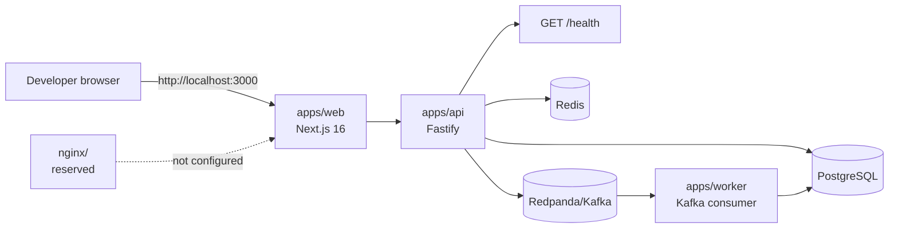
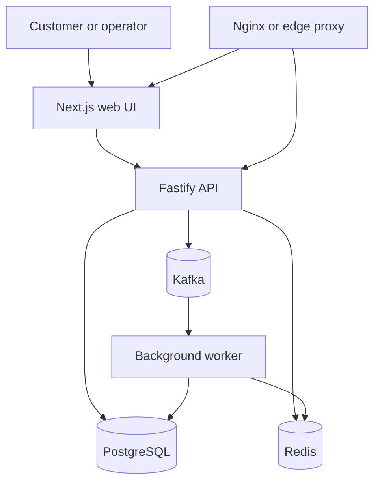

# Commerce Lab POC

## Current State

This repository is a small npm workspace for experimenting with a commerce application. It currently contains a Next.js web scaffold, a Fastify API with PostgreSQL, Redis, and Kafka integrations, an order-processing worker, and a Docker Compose development stack for PostgreSQL, Redis, and Redpanda. The web UI is still at the foundation stage, but the backend now has a working product and order flow.

## Repository Layout

```text
commerce-lab-poc/
├── apps/
│   ├── api/
│   │   ├── src/server.ts       # Fastify server and route registration
│   │   ├── src/routes/         # Product and order endpoints
│   │   ├── src/init-db.ts      # Tables and seed products
│   │   ├── src/db.ts           # PostgreSQL pool
│   │   ├── src/redis.ts        # Redis client
│   │   └── src/kafka.ts        # Kafka producer
│   │   ├── .env                # Local API/infrastructure connection settings
│   │   └── package.json        # API dependencies and dev command
│   ├── web/
│   │   ├── src/app/page.tsx    # Current Next.js home page
│   │   ├── src/app/layout.tsx  # Root layout and metadata
│   │   ├── src/app/globals.css # Tailwind import and global styles
│   │   └── package.json        # Next.js scripts and dependencies
│   └── worker/
│       ├── src/worker.ts       # Consumes order.created events
│       └── package.json        # Worker commands
├── nginx/                      # Reserved deployment/proxy area; empty currently
├── package.json                # Root npm workspace and shared dev commands
├── package-lock.json           # Locked npm dependency tree
├── docker-compose.yml          # Optional PostgreSQL, Redis, and Redpanda stack
├── README.md                   # New-developer setup guide
└── NOTES.md                    # Project state and learning notes
```

## Architecture Today



The web app calls the API to load products, create an order for the first cart item, and poll the order status. The backend runtime path is implemented: the API initializes PostgreSQL, reads and caches products, writes orders, publishes `order.created` events, and the worker consumes those events to confirm orders.

## Application Details

### Web: `apps/web`

- Next.js App Router application using React and TypeScript.
- Development server runs on `http://localhost:3000` by default.
- The home route is `src/app/page.tsx` and loads products, manages a client-side cart, submits orders, and polls order status.
- `src/app/layout.tsx` sets the document language, Geist fonts, and generated-app metadata.
- Tailwind CSS 4 is imported from `src/app/globals.css` through PostCSS.
- Available commands: `npm run dev`, `npm run build`, `npm run start`, and `npm run lint`.

### API: `apps/api`

- Fastify server with request logging enabled.
- CORS is enabled for all origins during this early development stage.
- `GET http://localhost:4000/health` returns:

```json
{ "status": "ok", "service": "commerce-lab-api" }
```

- The server loads `apps/api/.env` through `dotenv/config`.
- The port defaults to `4000` and can be changed with `PORT`, for example `PORT=4100 npm run dev --workspace=apps/api`.
- `tsx watch` restarts the server when TypeScript source files change.
- `npm run build` compiles `src/` to `dist/`; `npm run start` runs the compiled server.
- `initDb()` creates `products` and `orders` tables and seeds three products when the products table is empty.
- Product detail requests cache results in Redis for 5 minutes.
- Order creation validates positive integer `productId` and `quantity`, persists a `PENDING` order, and publishes an `order.created` Kafka event.
- `NEXT_PUBLIC_API_BASE_URL` configures the browser-facing API origin and defaults to an empty string.

Current API routes:

| Method | Route | Purpose |
| --- | --- | --- |
| `GET` | `/health` | API health check |
| `GET` | `/api/products` | List products |
| `GET` | `/api/products/:id` | Read a product through the Redis cache |
| `POST` | `/api/orders` | Create an order and publish an event |
| `GET` | `/api/orders/:id` | Read an order and its status |

### Local Infrastructure, Worker, and Nginx

`docker-compose.yml` defines three optional local services:

| Service | Image | Host port | Intended use |
| --- | --- | ---: | --- |
| PostgreSQL | `postgres:16-alpine` | `5433` (container `5432`) | Relational data |
| Redis | `redis:7-alpine` | `6379` | Cache and transient state |
| Redpanda | `redpandadata/redpanda:latest` | `9092` | Kafka-compatible events |

The worker is implemented and consumes `order.created` using the `order-processing` consumer group. It waits 3 seconds to represent processing, then updates the matching order to `CONFIRMED`. The `nginx` directory remains a placeholder with no reverse-proxy rules or deployment manifests.

### PostgreSQL Volume Initialization

The Compose file uses the named volume `commerce-lab-poc_postgres_data`. PostgreSQL reads `POSTGRES_USER`, `POSTGRES_PASSWORD`, and `POSTGRES_DB` only during first initialization. If an existing volume was created with different credentials, the current API URL (`commerce` user/database) can fail with `role "commerce" does not exist` even though the container environment shows `POSTGRES_USER=commerce`.

For disposable development data, reset and recreate the volume:

```bash
docker compose down -v
docker compose up -d postgres
```

This deletes the local database. If data must be preserved, do not remove the volume; recover the credentials used when it was initialized or connect with an existing administrator role and create/update the expected `commerce` role and database.

## Root Workspace Commands

The root `package.json` declares `apps/*` as npm workspaces:

```bash
npm install
npm run dev:web
npm run dev:api
npm run dev:worker
```

Use `npm run dev:worker` after the API and infrastructure are running. Use `docker compose up -d` directly when local infrastructure is needed.

## Intended Evolution



The web-to-API UI integration, API-to-PostgreSQL, API-to-Redis, API-to-Redpanda, and worker-to-PostgreSQL paths shown above are implemented. Nginx remains future work, and worker-side cache updates are a possible evolution of the current flow.

## Suggested Next Steps

1. Add API and worker tests for the health check, cache behavior, order validation, event publication, and confirmation flow.
2. Add shared event schemas and stronger error handling around database, Redis, and Kafka failures.
3. Add environment example files and document production-safe secrets handling.
4. Add graceful shutdown for Fastify, PostgreSQL, Redis, Kafka producer, and worker consumer.
5. Expand checkout to submit multiple cart items in one order.
6. Add Nginx or another deployment proxy only when the deployment topology is defined.

## Working Agreements

- Keep application code inside the relevant workspace under `apps/`.
- Update this file when the repository moves from scaffold to implemented behavior.
- Keep `README.md` focused on getting a new developer running quickly; keep design and implementation context here.
- Do not document a service as available until there is a runnable command and a verified health check.
