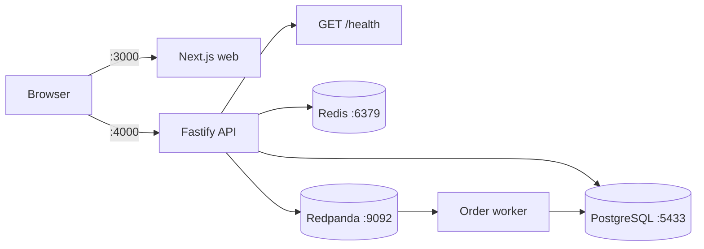
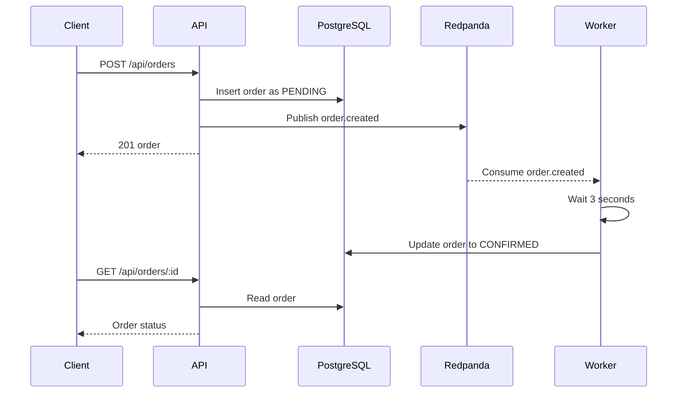

# Commerce Lab POC

An npm-workspaces monorepo for a commerce application proof of concept. The repository currently contains a Next.js web app, a Fastify API with product and order routes, an order-processing worker, and a Docker Compose stack for PostgreSQL, Redis, and Redpanda.

## Prerequisites

- macOS, Linux, or Windows with a terminal
- Node.js 20 or newer
- npm 10 or newer
- Git
- Docker Desktop or another Docker Compose installation if you want to run local infrastructure

Check your versions:

```bash
node --version
npm --version
```

Docker is required for the recommended local setup because PostgreSQL, Redis, and Redpanda run as local services. Docker is not required to view the web app, but the product list and checkout need a running API and its dependencies.

## First-Time Setup

From the repository root:

```bash
npm install
```

The root package is an npm workspace, so one install sets up dependencies for `apps/web`, `apps/api`, and `apps/worker`.

The API currently uses the `pg` pool for product and order runtime queries. Prisma provides the schema, migrations, generated client, and role seed used by the newer persistence setup.

The API reads local settings from `apps/api/.env` using dotenv. Do not commit real credentials or replace local development values with shared or production secrets.

## Start Local Infrastructure

Start PostgreSQL, Redis, and Redpanda from the repository root. For the recommended host-development workflow, start only these three services:

```bash
docker compose up -d postgres redis redpanda
docker compose ps
```

The services are exposed on these host ports:

| Service | Port | Local purpose |
| --- | ---: | --- |
| PostgreSQL | `5432` | Database |
| Redis | `6379` | Cache |
| Redpanda/Kafka | `9092` | Event broker |

Stop the services when finished:

```bash
docker compose down
```

Start these services before starting the API or worker. The API startup runs database initialization and connects its Kafka producer, so it will exit if PostgreSQL or Redpanda is unavailable.

On a fresh database, apply the Prisma migrations and seed the roles before starting the API:

```bash
cd apps/api
npx prisma migrate deploy
npx prisma db seed
cd ../..
```

## Start the Apps

Open four terminal windows, keeping the infrastructure and application processes running.

### Terminal 1: Web app

```bash
npm run dev:web
```

Before starting the web app, set `apps/web/.env.local` to point to the local API:

```dotenv
NEXT_PUBLIC_API_BASE_URL=http://localhost:4000
```

Then run:

```bash
npm run dev:web
```

Open [http://localhost:3000](http://localhost:3000). The web app loads products from the API, supports adding products to a cart, creates an order, and polls for confirmation.

### Terminal 2: API

```bash
npm run dev:api
```

Verify the API:

```bash
curl http://localhost:4000/health
```

Expected response:

```json
{"status":"ok","service":"commerce-lab-api"}
```

### Terminal 3: Worker

```bash
npm run dev:worker
```

The worker subscribes to the `order.created` topic with consumer group `order-processing`. When it receives an order event, it waits 3 seconds and updates that order from `PENDING` to `CONFIRMED`.

The API port defaults to `4000`. To use a different port, update `NEXT_PUBLIC_API_BASE_URL` to match it and restart the web app:

```bash
PORT=4100 npm run dev:api
curl http://localhost:4100/health
```

### Optional: full Docker Compose mode

To run the API, worker, and Nginx in containers as well as the infrastructure:

```bash
docker compose up -d --build
```

Open [http://localhost:8081](http://localhost:8081). Do not also run `npm run dev:api` or `npm run dev:worker`, because the Compose API uses port `4000` and the Compose worker consumes the same Kafka topic.

## Useful Commands

Run these from the repository root:

| Command | Purpose |
| --- | --- |
| `npm install` | Install all workspace dependencies |
| `npm run dev:web` | Start the Next.js development server |
| `npm run dev:api` | Start the Fastify API with file watching |
| `npm run dev:worker` | Start the order-processing Kafka worker |
| `npm exec prisma generate --workspace=apps/api` | Generate the Prisma client from the API schema |
| `npm exec prisma migrate deploy --workspace=apps/api` | Apply committed Prisma migrations |
| `npm exec prisma db seed --workspace=apps/api` | Seed the initial roles |
| `npm run build --workspace=apps/api` | Compile the API to `apps/api/dist` |
| `npm run start --workspace=apps/api` | Run the compiled API |
| `npm run build --workspace=apps/worker` | Compile the worker |
| `npm run start --workspace=apps/worker` | Run the compiled worker |
| `npm run build --workspace=apps/web` | Create a production web build |
| `npm run lint --workspace=apps/web` | Run the web ESLint checks |
| `npm run start --workspace=apps/web` | Serve a previously built web app |
| `npm run dev --workspace=apps/web` | Start the web app directly from its workspace |
| `npm run dev --workspace=apps/api` | Start the API directly from its workspace |

## Repository Structure

```text
apps/web    Next.js frontend
apps/api    Fastify backend, PostgreSQL access, Prisma schema, Redis cache, and Kafka producer
apps/worker  Kafka consumer that confirms orders
nginx       Reserved for future reverse-proxy configuration
docker-compose.yml  Optional PostgreSQL, Redis, and Redpanda services
NOTES.md    Current architecture, implementation notes, and next steps
```

## Current Architecture



The web app and API run as separate development processes. For direct local development, set `NEXT_PUBLIC_API_BASE_URL=http://localhost:4000`. The API has active PostgreSQL, Redis, and Kafka integrations, with matching local connection settings in `apps/api/.env`. PostgreSQL uses host port `5432`. The runtime still uses the `pg` pool for products and orders, while `apps/api/prisma/schema.prisma` contains the versioned Prisma models and migrations.

## API Routes

All business routes use the `/api` prefix.

| Method | Route | Behavior |
| --- | --- | --- |
| `GET` | `/health` | Returns API health information |
| `GET` | `/api/products` | Lists products ordered by ID |
| `GET` | `/api/products/:id` | Returns one product; uses Redis for a 5-minute cache |
| `POST` | `/api/orders` | Validates, creates, and publishes an order event |
| `GET` | `/api/orders/:id` | Returns one order by ID |

Create an order with a seeded product:

```bash
curl -X POST http://localhost:4000/api/orders \
	-H 'content-type: application/json' \
	-d '{"productId":1,"quantity":2}'
```

The request requires positive integer `productId` and `quantity`. The API initially stores the order as `PENDING`; the worker later changes it to `CONFIRMED`.

The current web checkout sends the first item in the cart to this endpoint. The cart can display multiple items, but order creation currently supports one product per request.

## Order Flow



## Troubleshooting

### Port already in use

Start the API on another port with `PORT=4100 npm run dev:api`. For the web app, stop the process using port 3000 or start Next.js with its own port option:

```bash
npm run dev:web -- --port 3001
```

### Dependencies are missing

Run `npm install` from the repository root, then repeat the start command. Avoid installing dependencies separately inside each app unless you are intentionally working on workspace tooling.

### Docker services do not start

Make sure Docker Desktop is running and check the service output:

```bash
docker compose logs
```

The standalone web app can run without Docker, but the API and worker require PostgreSQL and Redpanda. Check the service output:

### PostgreSQL says `role "commerce" does not exist`

PostgreSQL applies `POSTGRES_USER`, `POSTGRES_PASSWORD`, and `POSTGRES_DB` only when its data directory is initialized. If the `postgres_data` volume was created earlier with different values, changing `docker-compose.yml` will not recreate the role. The API then fails during database initialization before it can start.

For disposable local data, recreate the database volume:

```bash
docker compose down -v
docker compose up -d postgres redis redpanda
npm exec prisma migrate deploy --workspace=apps/api
npm exec prisma db seed --workspace=apps/api
npm run dev:api
```

`docker compose down -v` deletes the local PostgreSQL data volume. Do not run it if the database contains work you need. Preserve the volume first and recover the original database credentials or create the expected role using an existing administrator account.

### API command exits immediately

Make sure Docker services are running, the API `.env` points to PostgreSQL on port `5433`, and dependencies are installed. The supported command is `npm run dev:api`; it starts `apps/api/src/server.ts` through the workspace script.

## More Context

See [NOTES.md](NOTES.md) for the current implementation inventory, architecture diagrams, and proposed next steps.
